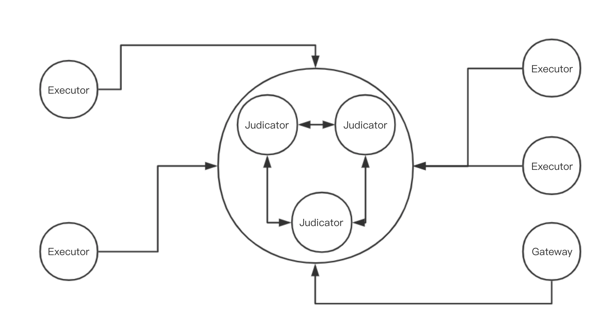
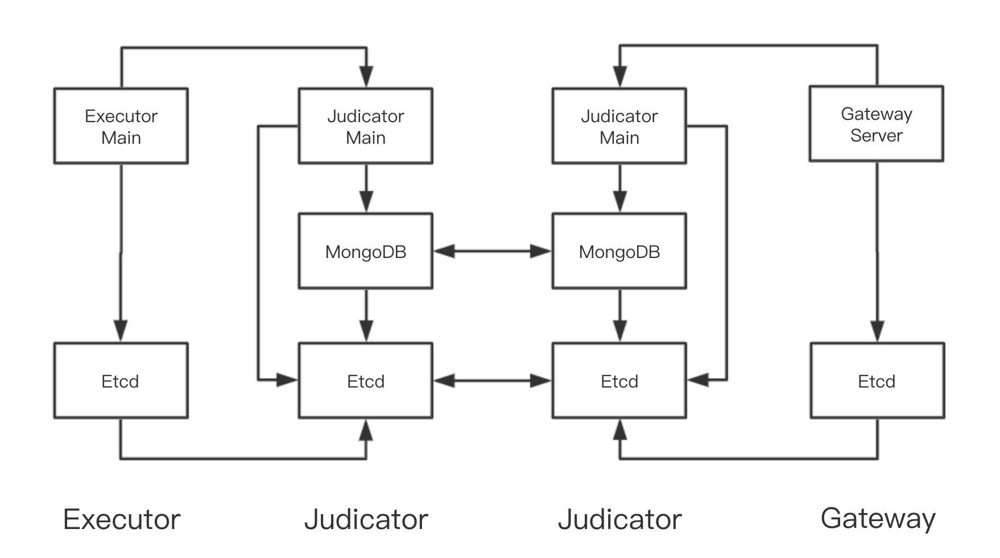
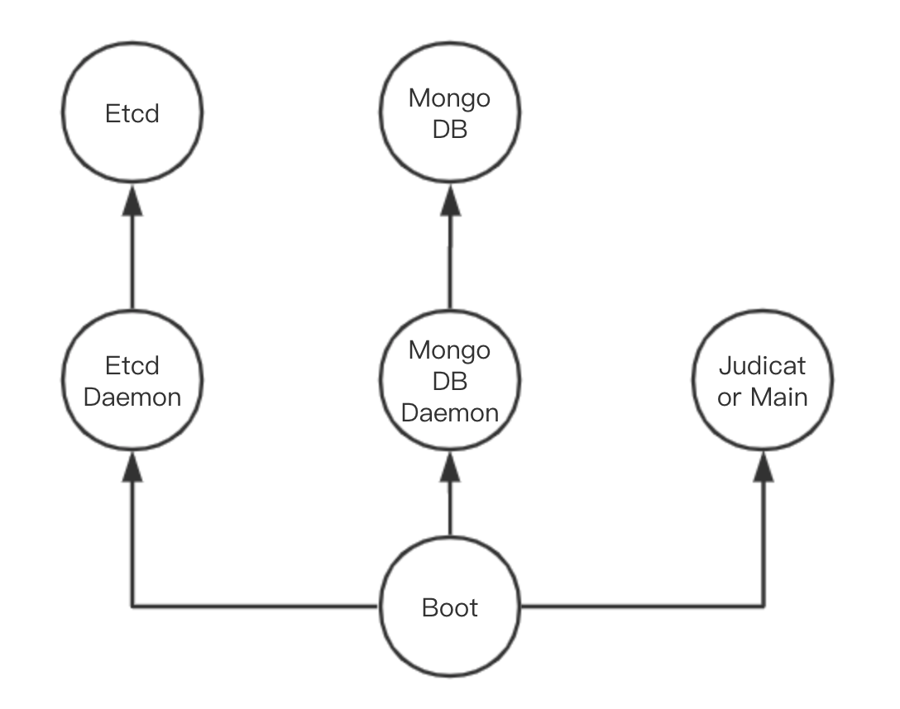
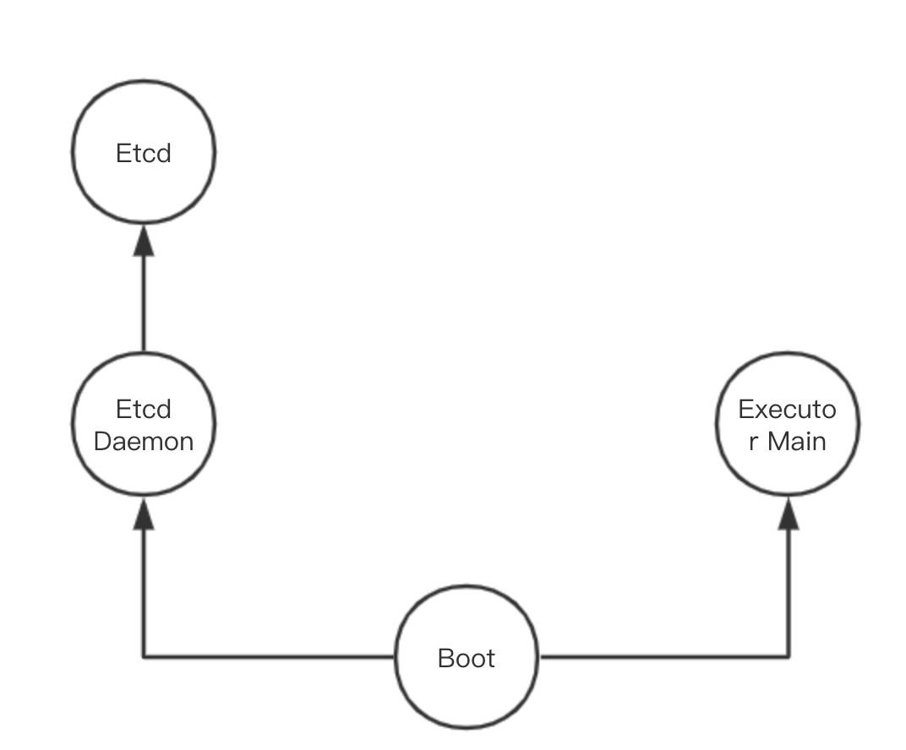

# Architecture

This page introduces the general architecture of the system.

## Overview

The system consists of three kind of nodes:
- **Judicator:** Manager nodes connecting to each other, forming a cluster with high availability. These nodes
maintain data of tasks using MongoDB, and provide task management interfaces through  Apache Thrift RPC to other nodes.
- **Executor:** Working nodes connecting to Judicators. Executors report to Judicators regularly,
through which Judicators assign tasks to Executors, and Executors send task execution result back to Judicators.
Executors swarm new processes for executing task and keep track of them.
- **Gateway:** Nodes connecting to Judicators and providing a website for task managements together with
HTTP API where requests are transferred to RPC interfaces provided by Judicators.

The general architecture of the system looks like the following.

## Layers in Nodes

There are different layers inside a node which form different layers.

#### Judicator

- **Etcd:** Etcd forms the bottom layer. The etcd component in Judicator node either initializes the cluster
or connects to the existing cluster by designated IP address or docker DNS. It forms an Etcd cluster providing
a uniform distributed key-value storage mechanism based on which higher layers may carry out clustering and
service detection.
- **MongoDB:** MongoDB layer is on the top of Etcd layer. MongoDB will use Etcd to check whether it is the first MongoDB
instance which should initialize the replica set. It also register self information on Etcd. The primary MongoDB
instance in the replica set is responsible to check the registered node information on Etcd and adjust membership in 
the MongoDB replica set. The MongdoDB replica set provides robust and uniform data storage for main layer.
- **Judicator Main:** Judicator main layer is based on both Etcd layer and MongoDB layer. This layer carries out logic
business. It uses Etcd to register itself as available services, and use MongoDB to store data for tasks and Executors.
It also uses Etcd to compete on a single key to perform leader election.

#### Executor
- **Etcd:** Similar to Judicators, Etcd also form the bottom layer in Executors. However, Etcd in Executor only
connects to Etcd cluster formed by Judicator Etcd in proxy mode.
- **Executor Main:** Executor main layer is based on Etcd layer and carries out logic business. It uses Etcd layer to
search for available Judicator main services after which report is going to maker.

#### Gateway
- **Etcd:** *Exactly the same to Etcd layer in Executors.*
- **Uwsgi / Gateway Server:** This layer takes the responsibility to provide HTTP service. Like Executor main, it
uses Etcd layer to search for available Judicator main services when required.

The structure of the system in the layer view looks like the following.

## Working Principles

As mentioned above, each node consists of several layers which will have one or more processes. All of these processes
will be started up by a single process. 

- **Boot:** All nodes start with a Boot process, which parsed argument for itself and all other components. The Boot 
program then starts up all components in subprocess. The Boot process also check the status of all subprocess regularly 
and restart those which is down.

#### Judicator

- **Etcd:** Etcd daemon process is started by Boot process. It loads config from config file and arguments first, then 
either initializes a cluster or joins an existing cluster. Upon joining, Etcd daemon will add local Etcd to the cluster 
first if not proxy mode is specified. It then fetch the list of nodes in the cluster which will be used to start up real
Etcd program. The daemon then start up real Etcd program, check its status and handle its log until receive SIGINT.
- **MongoDB:** Like Etcd, MongoDB daemon process is started up first by loading configs. Then the real MongoDB starts 
up. The main MongoDB daemon process begins to handle its output, but, before that, it swarm a thread to config MongoDB.
The thread, after checking the status of MongoDB, will check if it should initialize the replica set. It will then
register itself on Etcd, and enter a loop where the thread will check if the local MongoDB is the primary. If it is,
it will adjust membership of the replica set according to registered information on Etcd, including deleting those nodes
which are not registered in Etcd but exist in replica set, and adding those which are the opposite to the replica set.
Upon exiting, the MongoDB daemon will delete registration information on Etcd so that it will be later deleted by the 
primary node of MongoDB.
- **Judicator Main:** After Loading config, the main thread of Judicator main process will serve RPC interfaces. Other
two threads are responsible for registering itself on Etcd and compete against other Judicators for the leadership. The
leader will be responsible for deleting timed out Executors from the database and setting timed out tasks into retrying
status. RPC interfaces will also be served in threaded mode. All RPC interfaces will take corresponding MongoDB actions.
Judicator main process will also delete the registration information before exiting.

The Judicator processes relationship looks like the following.

#### Executor

- **Etcd:** *Same to Etcd in Judicators, but can only be run in proxy mode.*
- **Executor Main:** Again, it will load config first, before it begins to report to Judicators regularly. Before every
report, the Executor Main will collect all tasks, either completed or still running which will be later send to
Judicators through RPC invoking. As response, the Judicator will send back two lists, including tasks which should be
deleted from the current Executor, and tasks newly assigned to the Executor. While corresponding tasks are deleted,
those assigned tasks will be stored, and for each of them, a new thread will be generated. The thread will take proper
actions and swarm subprocess to compile and execute the task as well as maintaining its data.

The Executor processes relationship looks like the following.

#### Gateway
- **Etcd:** *Exactly the same to Etcd in Executors.*
- **Uwsgi:** The Uwsgi daemon will write loaded configuration into a ini file before start the real Uwsgi program. It
handles all of the Uwsgi's logs until receiving SIGINT.
- **Server:** The Server is a Flask object loaded by Uwsgi. It will take corresponding actions when receiving HTTP
requests, and invoke RPC calls to Judicators for most of the requests.

The Gateway processes relationship looks like the following.

**For more details about the working principles, please turn to the
pseudo code in [document/raw/pseudocode.md](raw/pseudocode.md) and the
source code of the program.**
